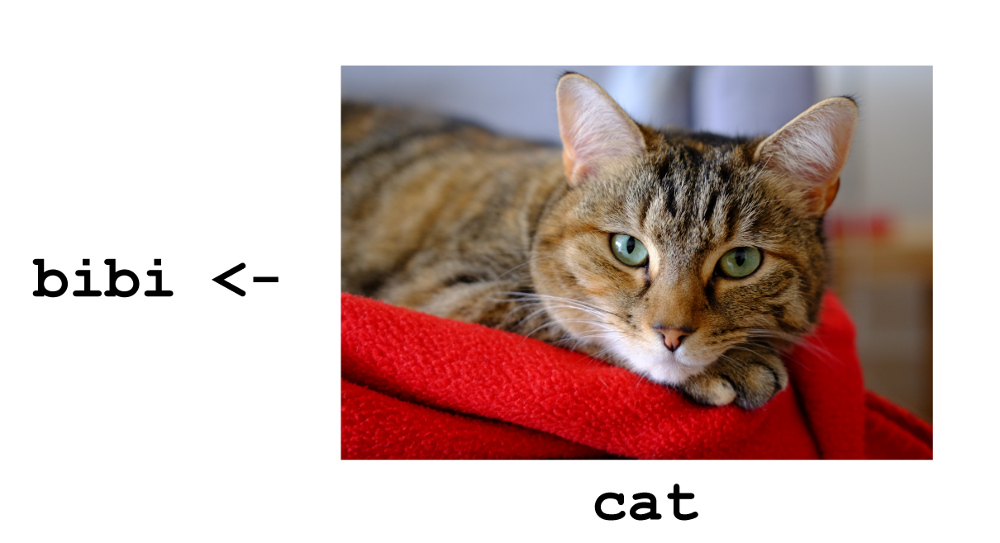

```{r setup, include=FALSE}
knitr::opts_chunk$set(echo = FALSE)
```
##

Etherpad: https://pad.carpentries.org/2018-10-09-umea 

Gapminder: https://raw.githubusercontent.com/swcarpentry/r-novice-gapminder/gh-pages/_episodes_rmd/data/gapminder_data.csv 

## The Carpentries

"...teaching researchers the computing skills they need to get more done in less time and with less pain. "

## Code of conduct

"We are committed to creating a friendly and respectful place for learning, teaching and contributing. All participants in our events and communications are expected to show respect and courtesy to others."

##
<div class="columns-2">
- Alistair Bailey
- website: ab604.uk
- email: ab604@soton.ac.uk
- twitter: @alistair604

```{r, out.width='100%', fig.align='left', fig.cap=''}
knitr::include_graphics('img/uk-southampton-map-07-10-2018.png')
```
</div>

## Me most of the time {.flexbox .vcenter .centered}

```{r, out.height='100%', fig.align='center', fig.cap=''}
knitr::include_graphics('img/imposter.jpg')
```

##

```{r, out.width='100%', fig.align='center', fig.cap=''}
knitr::include_graphics('img/practioner-programmer.png')
```

## 

Ross Ihaka and Robert Gentleman. 

R: A language for data analysis and graphics. Journal of Computational and Graphical Statistics, 5(3):299–314, 1996

##

“There are only two kinds of languages: the ones people complain about and the ones nobody uses”

Bjarne Stroustrup, C++ creator and developer

## @kierisi

[Jesse Mositpak](https://www.jessemaegan.com/post/r4ds-the-next-iteration/)

```{r, out.height='100%', fig.align='center', fig.cap=''}

```

[Jesse Mositpak](https://www.jessemaegan.com/post/r4ds-the-next-iteration/)

## Rstudio set-up

## Assigning objects {.flexbox .vcenter .centered}

```{r, out.width='100%', fig.align='center', fig.cap=''}

```

## {.flexbox .centered}

```{r, out.height='70%', fig.align='center', fig.cap=''}
knitr::include_graphics('img/r-vectors-07-10-2018.png')
```

## {.flexbox .centered}

```{r, out.height='60%', fig.align='center', fig.cap=''}
knitr::include_graphics('img/r-all-vectors-07-10-2018.png')
```

## {.flexbox .vcenter .centered}

```{r, out.width='100%', fig.align='center', fig.cap=''}
knitr::include_graphics('img/indexing.png')
```

## {.flexbox .vcenter .centered}

```{r, out.width='100%', fig.align='center', fig.cap=''}
knitr::include_graphics('img/data_frame.png')
```

## Tidy data

1. Each variable forms a <span style="color:red">column</span> 
2. Each observation forms a <span style="color:red">row</span>
3. Each observational unit forms a table

## dplyr::filter()

```{r, out.width='100%', fig.align='center', fig.cap=''}
knitr::include_graphics('img/dplyr_filter.png')
```

## dplyr::select()


```{r, out.width='100%', fig.align='center', fig.cap=''}
knitr::include_graphics('img/dplyr_select.png')
```

## dplyr::mutate()


```{r, out.width='100%', fig.align='center', fig.cap=''}
knitr::include_graphics('img/dplyr_mutate.png')
```

## dplyr::summarise

```{r, out.width='100%', fig.align='center', fig.cap=''}
knitr::include_graphics('img/dplyr_summarise.png')
```

## Functions

Name,body and set of arguments

```{r eval=FALSE, echo=TRUE}
# Roll two dice function
roll <- function(){
  die <- 1:6
  dice <- sample(die, size = 2, replace = TRUE)
  sum(dice)
}
```

```{r, out.width='25%', fig.align='center', fig.cap=''}
knitr::include_graphics('img/dice.jpg')
```

## Functions

```{r, out.width='50%', fig.align='center', fig.cap=''}
knitr::include_graphics('img/dnd_dice.JPG')
```

##

```{r, out.width='100%', fig.align='center', fig.cap=''}
knitr::include_graphics('img/r-dice-function-07-10-2018.png')
```

## GDP calculator

```{r eval=FALSE, echo=TRUE}
# Takes a dataset and multiplies the population column
# with the GDP per capita column.
calcGDP <- function(dat, yr=NULL, ctry=NULL) {
  # Is there a year argument?
  if(!is.null(yr)) {
   dat <- dat %>% filter(year == yr)
  }
  # Is there a country argument?
  if (!is.null(ctry)) {
   dat <- dat %>% filter(country == ctry)
  }
  # Create new GDP column
  new <- dat %>% mutate(gdp = pop * gdpPercap)
  return(new)
}
```

## Further resources

- [R4DS](http://r4ds.had.co.nz/)
- [Happy Git and R](http://happygitwithr.com/)
- [Working with Spreadsheets](https://peerj.com/preprints/3183/)
- [Naming things](https://speakerdeck.com/jennybc/how-to-name-files)

## R people to follow

- Hadley Wickham @hadleywickham
- Garrett Grolemund @StatGarrett
- Jenny Bryan @JennyBryan
- Mara Averick @datandme
- Thomas Lin Pedersen @thomasp85
- Julia Silge @juliasilge
- David Robinson @drob
- Maëlle Salmon @ma_salmon
- Jesse Mostipak @kierisi