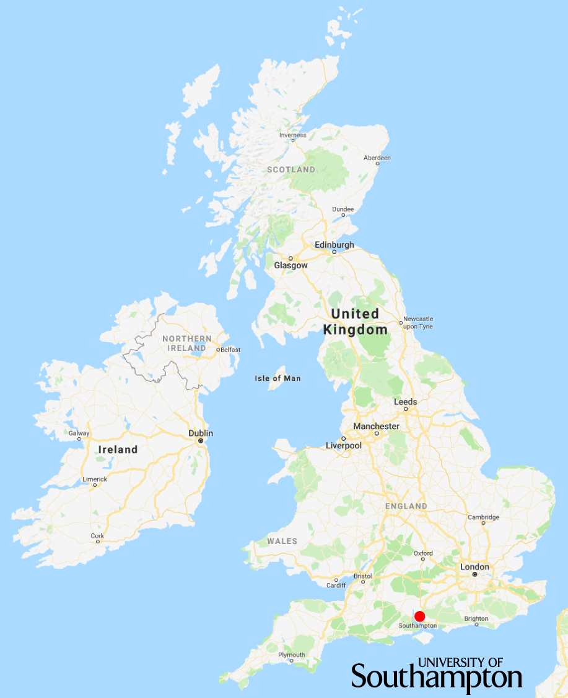
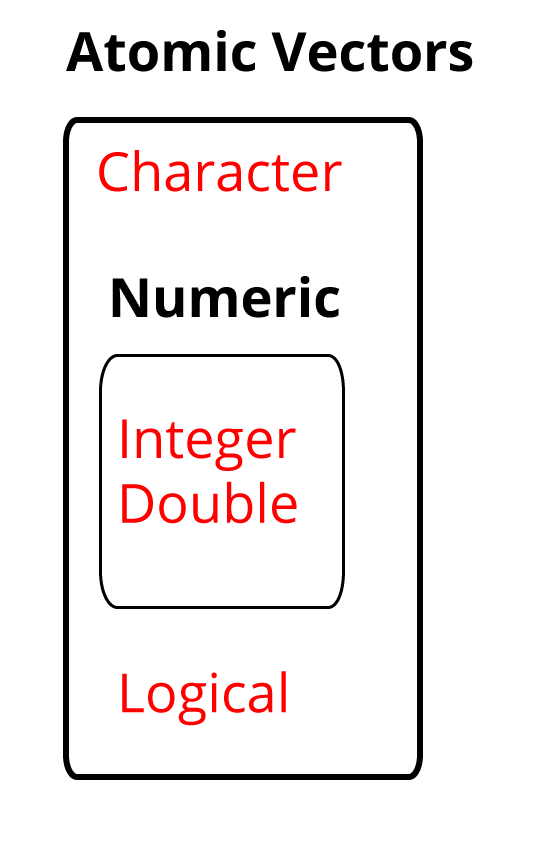
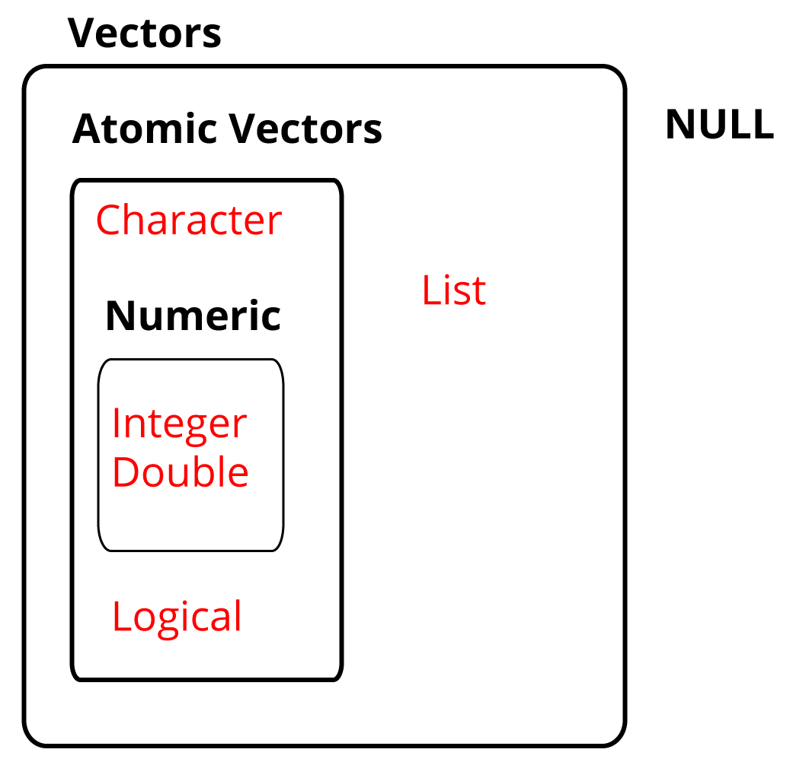
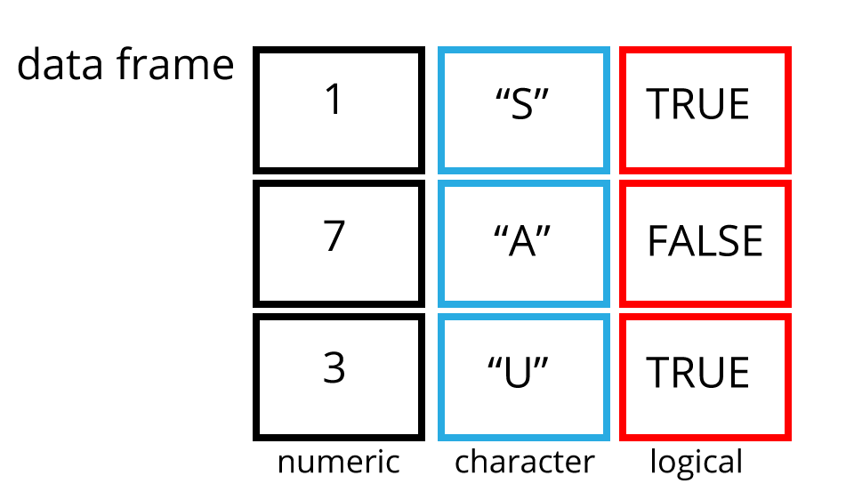
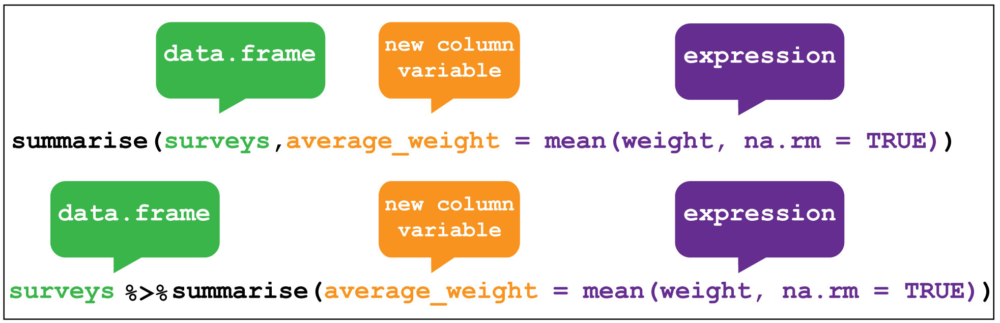
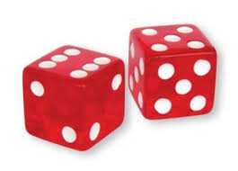
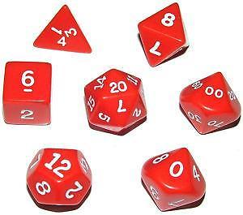
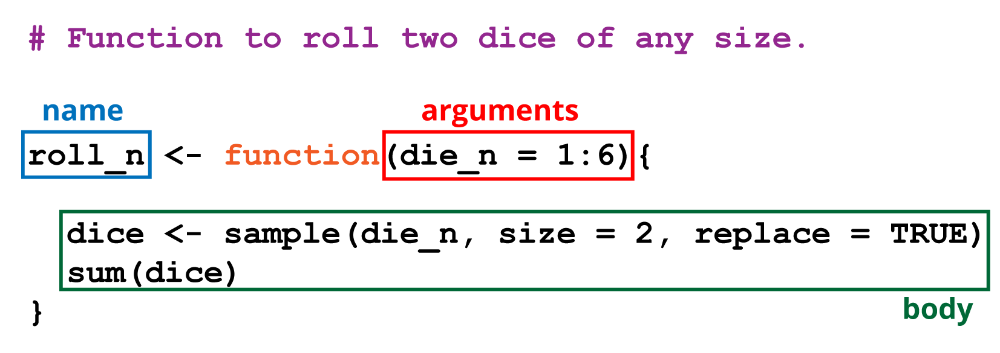

```{r setup, include=FALSE}
knitr::opts_chunk$set(echo = FALSE)
```
##

Etherpad: https://pad.carpentries.org/2018-10-09-umea 
Gapminder: https://raw.githubusercontent.com/swcarpentry/r-novice-gapminder/gh-pages/_episodes_rmd/data/gapminder_data.csv 

##
<div class="columns-2">
- Alistair Bailey
- website: ab604.uk
- email: ab604@soton.ac.uk
- twitter: @alistair604

```{r, out.width='100%', fig.align='left', fig.cap=''}

```
</div>

## Me most of the time {.flexbox .vcenter .centered}

```{r, out.height='100%', fig.align='center', fig.cap=''}
knitr::include_graphics('img/imposter.jpg')
```

##

```{r, out.height='100%', fig.align='center', fig.cap=''}

```

## Rstudio set-up

## Atomic vectors {.flexbox .vcenter .centered}

```{r, out.height='100%', fig.align='center', fig.cap=''}

```

## All vectors {.flexbox .vcenter .centered}

```{r, out.height='100%', fig.align='center', fig.cap=''}

```


## {.flexbox .vcenter .centered}

```{r, out.width='100%', fig.align='center', fig.cap=''}

```

## Tidy data

1. Each variable forms a <span style="color:red">column</span> 
2. Each observation forms a <span style="color:red">row</span>
3. Each observational unit forms a table

## dplyr::filter()

```{r, out.width='100%', fig.align='center', fig.cap=''}
knitr::include_graphics('img/dplyr_filter.png')
```

## dplyr::select()


```{r, out.width='100%', fig.align='center', fig.cap=''}
knitr::include_graphics('img/dplyr_select.png')
```

## dplyr::mutate()


```{r, out.width='100%', fig.align='center', fig.cap=''}
knitr::include_graphics('img/dplyr_mutate.png')
```

## dplyr::summarise

```{r, out.width='100%', fig.align='center', fig.cap=''}

```

## Functions

Name,body and set of arguments

```{r eval=FALSE, echo=TRUE}
# Roll two dice function
roll <- function(){
  die <- 1:6
  dice <- sample(die, size = 2, replace = TRUE)
  sum(dice)
}
```

```{r, out.width='25%', fig.align='center', fig.cap=''}

```

## Functions

```{r, out.width='50%', fig.align='center', fig.cap=''}

```

##

```{r, out.width='100%', fig.align='center', fig.cap=''}

```

## GDP calculator

```{r eval=FALSE, echo=TRUE}
# Takes a dataset and multiplies the population column
# with the GDP per capita column.
calcGDP <- function(dat, yr=NULL, ctry=NULL) {
  # Is there a year argument?
  if(!is.null(yr)) {
   dat <- dat %>% filter(year == yr)
  }
  # Is there a country argument?
  if (!is.null(ctry)) {
   dat <- dat %>% filter(country == ctry)
  }
  # Create new GDP column
  new <- dat %>% mutate(gdp = pop * gdpPercap)
  return(new)
}
```

## Further resources

R4DS 
Happy Git and Github
Spreadsheets

## R people to follow

Hadley Wickham @hadleywickham
Garrett Grolemund @StatGarrett
Jenny Bryan @JennyBryan
Mara Averick @datandme
Thomas Lin Pedersen @thomasp85
Julia Silge @juliasilge
David Robinson @drob
Malle Salmon @ma_salmon