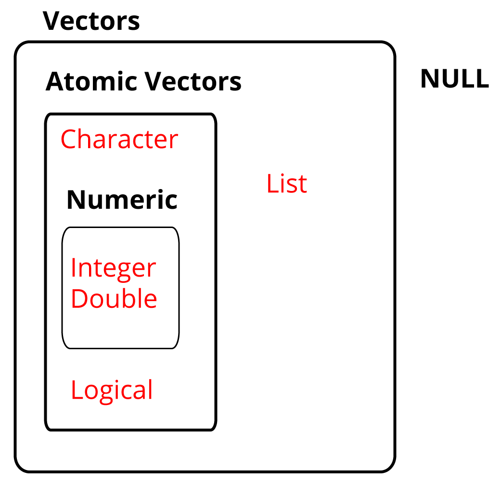
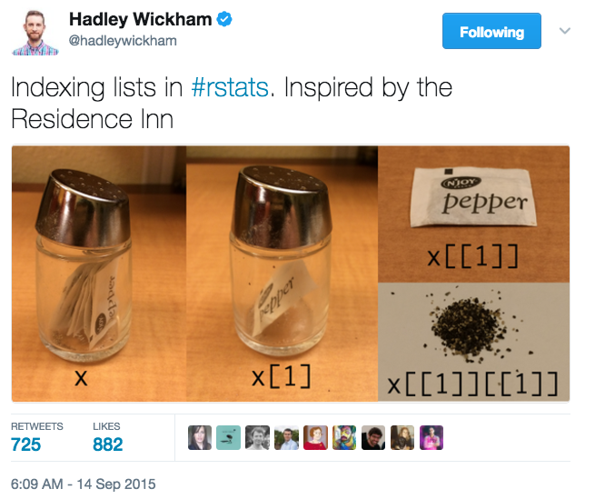
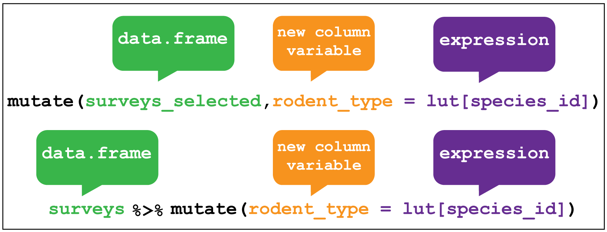

```{r setup, include=FALSE}
knitr::opts_chunk$set(echo = FALSE)
```

##
<div class="columns-2">
- Alistair Bailey
- website: ab604.uk
- email: ab604@soton.ac.uk
- twitter: @alistair604

```{r, out.width='100%', fig.align='left', fig.cap=''}
knitr::include_graphics('img/uk-southampton-map-07-10-2018.png')
```
</div>

## Imposter syndrome {.flexbox .vcenter .centered}

```{r, out.height='100%', fig.align='center', fig.cap=''}
knitr::include_graphics('img/imposter.jpg')
```

##

```{r, out.width='100%', fig.align='center', fig.cap=''}
knitr::include_graphics('img/practioner-programmer.png')
```

## Official lesson materials

All the official software carpentry lesson materials can be found [here](http://swcarpentry.github.io/r-novice-gapminder/)

The official materials mostly use base R, we used a mixture of base R and the [tidyverse](https://www.tidyverse.org/)

## Syllabus

- Intro to R and RStudio 
- Importing data
- Transforming data with dplyr
- Functions in R
- Visualising data with ggplot

## Getting help
- Google: *'Typically adding “R” to a query is enough to restrict it to relevant results'*. Hadley Wickham
- Check out the help pages using `?function_name` e.g. `?mean`
- Join [RStudio Community](https://community.rstudio.com/)
- Learn how to make a [reproducible example](https://www.tidyverse.org/help/)

## Atomic vectors  | One-dimensional groups, the key building blocks of R objects {.flexbox .vcenter .centered}

```{r, out.height='100%', fig.align='center', fig.cap=''}
knitr::include_graphics('img/r-vectors-07-10-2018.png')
```

## Factors

Factors are Rs way of storing categorical information such as eye colour or car type. 

A factor is something that can only have certain values, and can be ordered (such as low,medium,high) or unordered such as types of fruit.

**Factors look like strings, but behave like integers**

## Lists | Lists group objects instead of individual values, such as several atomic vectors of different sizes. NULL is the absence of a vector. {.flexbox .vcenter}

```{r,out.height='80%',out.width='50%',fig.asp=1,fig.align='center', fig.cap=''}

```

## Lists {.flexbox .vcenter .centered}

```{r, out.width='100%', fig.align='center', fig.cap=''}

```

## Matrices and arrays

Matrices store values in a two dimensional array, whilst arrays can have `n` dimensions. 

## Data frames | Two dimensional versions of lists, where each atomic vector is the same length.  {.flexbox .vcenter .centered}

```{r, out.width='70%', fig.align='center', fig.cap=''}
knitr::include_graphics('img/data_frame.png')
```

## Tidy data

1. Each variable forms a <span style="color:red">column</span> 
2. Each observation forms a <span style="color:red">row</span>
3. Each observational unit forms a table

## Gapminder data

[Gapminder Foundation](https://www.gapminder.org/)

The [workshop data](https://raw.githubusercontent.com/swcarpentry/r-novice-gapminder/gh-pages/_episodes_rmd/data/gapminder_data.csv ) is already tidy.

We load it using `readr` package function `read_csv()`

## Gapminder data

An excerpt of data for teaching containing observations of six variables:

- `country`
- `continent`
- `year`
- `lifeExp`  - life expectancy at birth
- `pop`  - total population
- `gdpPercap` - per-capita GDP (Gross domestic product)

## dplyr::filter()

```{r, out.width='100%', fig.align='center', fig.cap=''}
knitr::include_graphics('img/dplyr_filter.png')
```

## dplyr::select()


```{r, out.width='100%', fig.align='center', fig.cap=''}
knitr::include_graphics('img/dplyr_select.png')
```

## dplyr::mutate()


```{r, out.width='100%', fig.align='center', fig.cap=''}

```

## dplyr::summarise

```{r, out.width='100%', fig.align='center', fig.cap=''}
knitr::include_graphics('img/dplyr_summarise.png')
```

## Functions | Garrett Grolemund, Hands-on programming with R

Three components: name, body and a set of arguments

```{r eval=FALSE, echo=TRUE}
# Roll two dice function
roll <- function(){
  die <- 1:6
  dice <- sample(die, size = 2, replace = TRUE)
  sum(dice)
}
```

```{r, out.width='25%', fig.align='center', fig.cap=''}
knitr::include_graphics('img/dice.jpg')
```

## Functions

```{r, out.width='50%', fig.align='center', fig.cap=''}
knitr::include_graphics('img/dnd_dice.JPG')
```

##

```{r, out.width='100%', fig.align='center', fig.cap=''}
knitr::include_graphics('img/r-dice-function-07-10-2018.png')
```

## GDP calculator

```{r eval=FALSE, echo=TRUE}
# Takes a dataset and multiplies the population column
# with the GDP per capita column.
calcGDP <- function(dat, yr=NULL, ctry=NULL) {
  # Is there a year argument?
  if(!is.null(yr)) {
   dat <- dat %>% filter(year == yr)
  }
  # Is there a country argument?
  if (!is.null(ctry)) {
   dat <- dat %>% filter(country == ctry)
  }
  # Create new GDP column
  new <- dat %>% mutate(gdp = pop * gdpPercap)
  return(new)
}
```

## Further resources